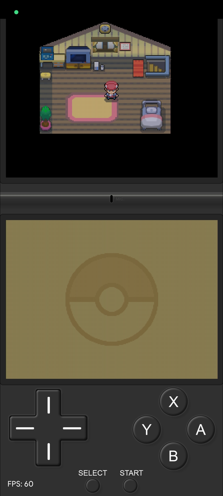
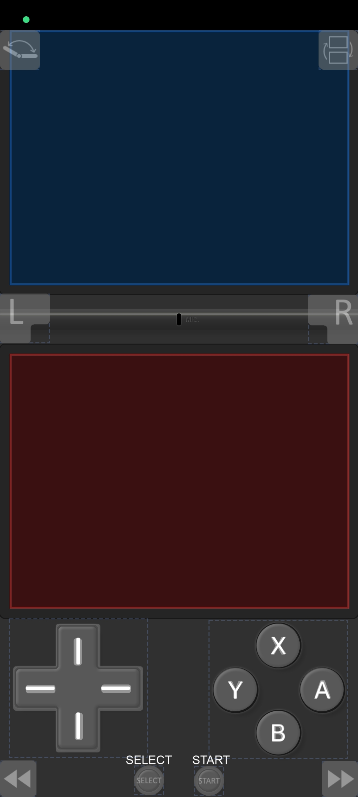

# Nintendo DS Overlay

This is a Nintendo DS overlay for melonDS, made for modern 20:9 (2400x1080) screen Android devices.

I'm open to suggestions!

# Installation and Setup

<b>1.</b> Download latest melonDS release.

<b>2.</b> Download latest release of my overlay and extract <b>maestrosistema.png</b> in any folder of your phone

<b>3.</b> Open melonDS, touch <b>Layouts</b> in <b>Input</b> settings and create a new Layout by clicking on the <b>+</b> button

<b>4.</b> Touch <b>Menu</b>, then <b>Properties</b>, set <b>Layout orientation</b> to <b>Portrait</b>, disable <b>Use default opacity</b> and set <b>Layout opacity</b> to 0, finally touch OK

<b>5.</b> Open <b>Menu</b> again, then <b>Backgrounds</b>. Touch <b>Portrait background</b>, then hit the <b>+</b> button and select the previously extracted <b>maestrosistema.png</b>, name it and press OK, now select it and press OK again

<b>6.</b> Set screens size to <b>1024</b> by touching them and drag them to fit in the overlay. Drag D-Pad, ABXY, Start and Select buttons to overlap the ones on the background, resize them if needed. Put L and R anywhere you want, default position is OK. If you want you can add function buttons like Rewind, Swap Screens, Quick Save, etc. and position them where you want.

Example of Layout positioning:

<b>7.</b> Open <b>Menu</b> then tap <b>Save and exit</b>, give a <b>Layout name</b> and press OK

<b>8.</b> Select your newly created Layout then play!

# Donation
If you like my work, please consider a small donation.

You can donate with <a href="https://paypal.me/maestrosistema?country.x=IT&locale.x=it_IT"><b>PayPal</b></a> or <a href="https://ko-fi.com/maestrosistema"><b>Ko-Fi</b></a>.

Thank You!

# Special Thanks
melonDS Team and Rafael Caetano

# Disclaimer
<b>Nintendo DS</b> is a trademark of <b>Nintendo Co., Ltd</b>

<b>Android</b> is a trademark of <b>Google LLC</b>
